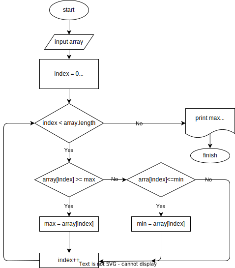

# Домашнее задание 2

Решить следующие задачи. Нарисовать блок-схемы:

1. Нахождение индексов максимального и минимального элемента массива

2. Задание на «разворот» массива. Нужно перевернуть массив и записать его в обратном порядке.

3. **Задача повышенной сложности. Найти сумму элементов массива, лежащих между максимальным и минимальным по значению элементами

4. *Найти среднее арифметическое среди всех элементов массива.

