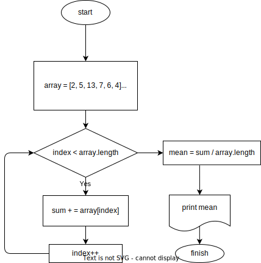

# Урок 3. Сравниваем разные алгоритмы решения задач

Задача 1. Найти среднее арифметическое среди всех элементов массива [2, 5, 13, 7, 6, 4] с помощью блок-схемы



Задача 2. Составьте блок-схему на основе псевдокода

```pseudo
array = [2, 5, 13, 7, 6, 4]
index = 0
sum = 0
mean = 0
while (index < array.length) do
    sum += array[index]
    index += 1
mean = sum / array.length
print(mean)
```
