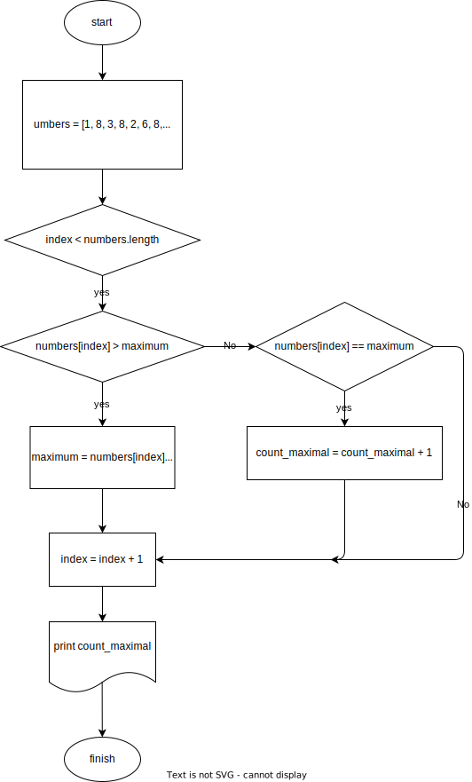

# Урок 3. Сравниваем разные алгоритмы решения задач

Задача 1. Найти среднее арифметическое среди всех элементов массива [2, 5, 13, 7, 6, 4] с помощью блок-схемы

```pseudo
numbers = [2, 5, 13, 7, 6, 4]
size = 6
sum = 0
avg = 0
index = 0
while (index < size) do
    sum += numbers[index]
    index += 1
avg = sum / size
print(avg)
```

Задача 2. Составьте блок-схему на основе псевдокода


